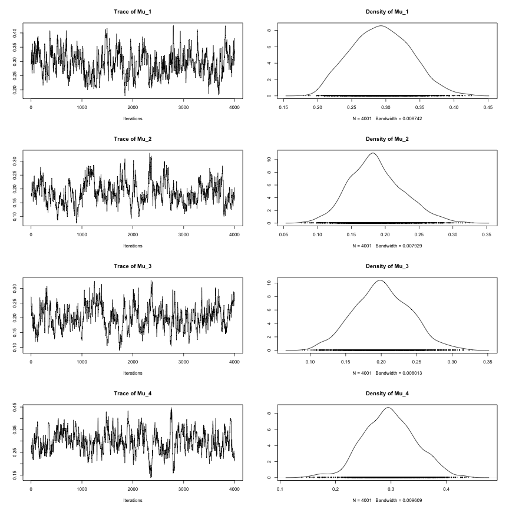
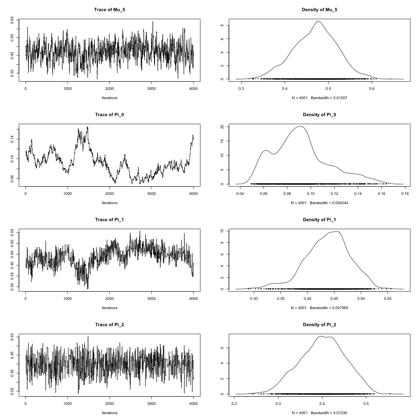
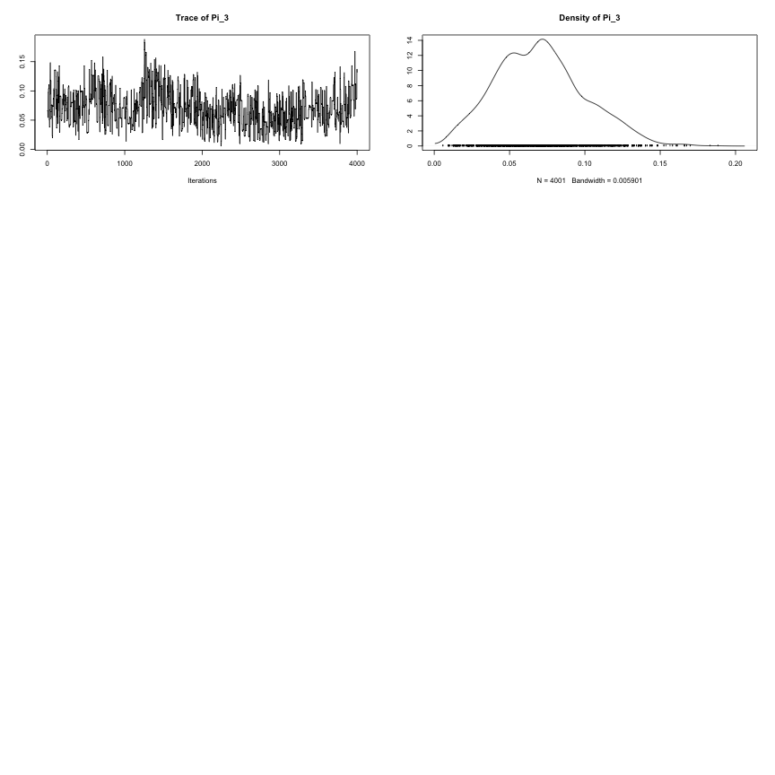

Acceptance Rate

```
## [1] 0.4413897 0.2461885
```

   

Compare the Truth, MLE, Posterior Estimates, and prior.

```
##       true  mle.gold mc.est prior
## Mu_1 0.259 0.2033333  0.292 0.275
## Mu_2 0.157 0.1100000  0.187 0.283
## Mu_3 0.165 0.1500000  0.203 0.276
## Mu_4 0.288 0.2633333  0.296 0.275
## Mu_5 0.541 0.5066667  0.471 0.277
## Pi_0 0.103 0.1133333  0.092 0.124
## Pi_1 0.513 0.5600000  0.437 0.498
## Pi_2 0.256 0.3066667  0.400 0.246
## Pi_3 0.128 0.0200000  0.071 0.131
##      0.000 0.0000000  0.000 0.000
##      0.000 0.0000000  0.000 0.000
```

Using a different burnin period.

```
##       true  mle.gold mc.est prior
## Mu_1 0.259 0.2033333  0.293 0.275
## Mu_2 0.157 0.1100000  0.187 0.283
## Mu_3 0.165 0.1500000  0.201 0.276
## Mu_4 0.288 0.2633333  0.298 0.275
## Mu_5 0.541 0.5066667  0.470 0.277
## Pi_0 0.103 0.1133333  0.091 0.124
## Pi_1 0.513 0.5600000  0.438 0.498
## Pi_2 0.256 0.3066667  0.401 0.246
## Pi_3 0.128 0.0200000  0.070 0.131
##      0.000 0.0000000  0.000 0.000
##      0.000 0.0000000  0.000 0.000
```

Chain Diagnosis


